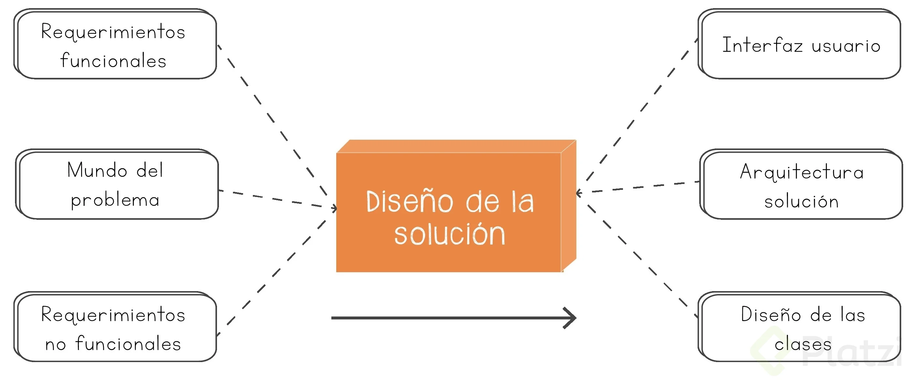

# Fundamentos de arquitectura de software

## Etapas del proceso de desarrollo de software

### Analisis de Requerimientos

Se inicia de un disparador, una idea, un problema a resolver o alguna necesidad.Entender que se construirá, cubrir los requerimientos de negocios, 
de usuarios, funcionales y no funcionales, dando como resultado una compresión muy clara a resolver.

### Diseño de la Solución

Se tiene un análisis del problema y una propuesta de diseño a la solución del problema. En esta etapa el analista, arquitecto o equipo de desarrollo trabajan en conjunto para plantear cuales son las posibles soluciones a los problemas en diferentes alternativas como propuesta de valor: modelos, productos open source, documentación, frameworks.

### Desarrollo y Evaluación

Los programadores desarrollan, implementan, evalúan, ejecutan tests para garantizar la solución de lo que se espera. Los criterios de aceptación de la 
solución necesitan un set de requerimientos necesarios para ser la conexión entre la etapa anterior y la de desarrollo y evaluación. Al finalizar esta 
etapa obtendremos un artefacto de software.

### Despliegue

En esta etapa se necesita de la infraestructura, roles de operación para poder dárselo al usuario final. Un ejemplo puede ser una aplicación de web alojada en un servidor o una app móvil alojada en una app store.

### Mantenimiento y Evolución

Se esta atento a la detección de errores y cualquier nueva funcionalidad a desarrollar para realizar cambios en la aplicación y volver a poner a disponibilidad del usuario. Es decir en esta etapa se mantiene el software hasta que se considere lo contrario.

## Dificultades en el desarrollo de software

### Esenciales

Los problemas esenciales son los tratan sobre el entendimiento del concepto que vamos a solucionar,entender el diseño que vamos a hacer.

#### Complejidad

Cuando el problema a resolver es complejo en sí mismo.

#### Conformidad

Entender en que contexto se usará el producto y como se adecuada al contexto imperfecto (Ejemplo: ¿Requiere internet, que disponibilidad existe de Internet?, ¿Requiere actualizaciones mayores?)

#### Tolerancia al cambio

La medición de cuanto podemos adaptarnos a los cambios.

#### Invisibilidad

Dificultad de entender su forma, ya que es intangible, solo existen en código o documentación.

### Accidentales

Son los problemas que tiene que ver con la plataforma con la que vamos a implementar la solución, con la tecnologia que vamos a usar o el lenguaje, frameworks, etc. Son los problemas que a menudo nos encontramos y son los generan frustración debido a que son bloqueantes en las actividades que deseamos realizar.

#### Lenguajes de alto nivel

La maquina entiende cero y unos, si la maquina entendiera el lenguaje humano no seria necesario trabajar con lenguaje de alto nivel.

#### Multi-procesamiento

Resuelve el problema del feedback, se puede obtener sistemas mas optimizados y con mejor feedback gracias a la tecnologia del multi-procesamiento.

#### Entornos de programación

Facilita mucho el desarrollo de código, mediante libreria, herramientas, api, etc para poder optimizar el desarrollo.

### ¿Como resolvemos las dificultades esenciales?

#### No desarrollar
Utilizar un sistema ya existente, aprovechar el open source. 

#### Prototipado rápido
Es obtener feedback lo antes posible, ir avanzando en pasos pequeños. Y valerme del usuario. 

#### Desarrollo evolutivo
Plantea que vayas teniendo con resultados mas que pequeño e ir evolucionando esto.

#### Grandes diseñadores (Arquitectos)
Saben abstraerse del problema puntual y entender un problema más general. Obteniendo una resolucion elegante.

## Roles

### Experto del dominio

Partes Interesadas (Stakeholders)

### Analista

Cliente (Dueño del Producto)

### Administrador de sistemas

DevOps /SRE (Site Reliability Engineer)

### Equipo de Desarrollo

- QA - Tester
- Desarrollador
- Arquitecto

### Gestor del Proyecto

Facilitador

|Caracteristicas	| Cascada	| Ágiles|
|-------------------|-----------|-------|
| Expertos del producto	| Expertos de dominio |	Stakeholder |
| Definen los alcances	| Analista	| Product Owner |
| Crean el producto	| QA, Desarrollador, Arquitecto (aislados) | Equipo de desarrollo
| Responsables de la Infraestructura | Administrador de Sistemas | DevOps/SRE (Site Reliability Engineering)
| Gestionan/Entregan el proyecto | Project/Product Manager | Facilitadores

## Introducción a la arquitectura de software

### ¿Que es arquitectura de software?

La arquitectura, más que un modelo es algo estructural. El concepto de arquitectura de software se refiere a la estructuración del sistema que, idealmente, se crea en etapas tempranas del desarrollo. Esta estructuración representa un diseño de alto nivel del sistema que tiene dos propósitos

* satisfacer los atributos de calidad (desempeño, seguridad, modificabilidad)
* ñservir como guía en el desarrollo.

El no crear este diseño desde etapas tempranas del desarrollo puede limitar severamente el que el producto final satisfaga las necesidades de los clientes. Además, el costo de las correcciones relacionadas con problemas en la arquitectura es muy elevado. Es así que la arquitectura de software juega un papel fundamental dentro del desarrollo.

#### Definicion 1

#### Definicion 2

#### Definición 3

### Ejemplos

#### Ejemplo de Arquitectura de Twitter

#### Ejemplo de Amazon Web Services

#### Ejemplo de Arquitectura de Aplicación Frontend React

## La importancia de la comunicación - Ley de Conway

Establece que la estructura de un sistema de software refleja inevitablemente la estructura de comunicación de la organización que lo desarrolla. Es decir, la forma en que los equipos están organizados y se comunican influye directamente en el diseño técnico del producto. Organizaciones que diseñan sistemas están condenadas a producir diseños que copian sus estructuras de comunicación.

## Objetivos del Arquitecto

El arquitecto tiene diferentes stakeholders con sus respectivos requerimientos. Debe conectar a las partes interesadas y los requerimientos de los mismos con la implementación del sistema. Es decir tiene una visión global del proyecto en general y debe diseñar el software de tal manera que cumpla con los requerimientos de todas las partes interesadas. Con todo esto en mente el Arquitecto deberá tomar las mejores decisiones para que el impacto del diseño sea agradable para todas estas partes.

### Partes interesadas o Stakeholders

#### Cliente 
Quiere tener su sistema respetando el presupuesto establecido y entregado a tiempo. Deberá preocuparse por encontrar cuáles son los mayores riesgos y evitarlos.

#### Manager 
Querrá cumplir con los requerimientos del cliente y además tener la posibilidad de crear equipos que puedan autogestionarse y atacar diferentes partes del sistema de forma simultanea.

#### Dev 
Que sea fácil de implementar y mantener.

#### Usuario 
Que funcione, que haga lo que tiene que hacer cuando lo tenga que hacer.

#### Tester QA 
Que sea fácil de probar.

## Arquitectura y Metodologías

### Metodologías Tradicionales
El arquitecto diseña una solución basada en los Requerimientos, Restricciones y Riesgos. De este diseño resulta un Modelo y una Documentación respectiva a su Implementación. Durante esta etapa de Diseño no hay Implementación de Software.

### Metodologías ágiles
La Arquitectura emerge de un equipo autogestionado que realiza el diseño de una solución como algo evolutivo momento a momento (sprint a sprint) lo que da lugar a reevaluar las decisiones tomadas. A su vez no se adelanta a tomar decisiones que pueden ser postergadas a menos que sea absolutamente necesario. Durante cada sprint realiza una rápida implementación para poder tener feedback a través de métricas y alertas, para luego mediante una retrospectiva, reevaluar o no decisiones tomadas. Otra cosa importante en el desarrollo ágil es la posibilidad de implementar “esqueletos de la aplicación" (Tracer Bullet) que nos permiten testear todas las capas de nuestra arquitectura y crear una columna vertebral a partir de la cual luego hacer incrementos de funcionalidad.

## Entender el problema

La parte más importante de entender el problema es: separar la comprensión del problema de la propuesta de solución, si no se entiende la diferencia entre estos dos puntos se tiende a solucionar problemas inexistentes y a hacer sobreingeniería.

### Espacio del Problema
Detalla ¿que es lo que se va a resolver? (y qué no se va a resolver) sin entrar en detalles del “cómo”.(analisis del problema). El espacio del problema nos ayuda a entender que es lo que vamos a resolver y exactamente como imaginamos como esto va agregar un valor a nuestros usuarios sin entrar en detalle de cómo lo va a resolver el sistema.

* Idea: ¿Qué queremos resolver?
* Criterios de éxito: ¿Cómo identificamos si estamos resolviendo el problema?
* Historias de usuario: Supuestos de historias de lo que va a ganar el usuario al utilizar la solución usando las características del problema a resolver. .

### Espacio de la Solución
Brinda el detalle del ¿“cómo” se va a resolver?, reflejando los detalles del problema detectado y evitando resolver problemas que no se quiere o necesita resolver.(detalles técnicos). Se refleja en el espacio del problema y trata de resolverlo teniendo en cuenta todos los detalles técnicos necesarios. . Consta de:

* Diseño: todo lo referente a la planificacion del software, desde diseño UI, UX hasta diseño de sistemas
* Desarrollo: escribir el codigo, configuraciones y contrataciones de servicios
* Evaluación: medir la eficiencia y eficacia del software frente al problema
* Criterios de aceptación: medir el impacto del software, no importa lo bueno que sea el problema si los usuarios no lo usan o no le ven uso
* Despliegue (deploy): lanzar el software en ambientes productivos (mercado) y empezar a mejorar las caracteristicas con un feedback loop (crear, medir, aprender)

## Requerimientos

Una vez que entendemos el espacio del problema y el espacio de la solución, vamos a entrar a analizar los requerimientos de nuestro sistema.

### Requerimientos de producto: 

Los podemos dividir en 3 capas.

#### Capa de negocio (Reglas de negocio → Requerimientos de negocio)

Son aquellas normas que rigen el proceso y la solución del problema principal

#### Capa de usuario (Requerimientos de usuario → Atributos de calidad → Requerimietos no funcionales)

Tienen que ver en cómo el usuario se desenvuelve usando el sistema, qué atributos comunes y de calidad por sobre otros, y operaciones puede 
operar ésta entidad. Por ejemplo, que un tipo de usuario tenga mayor autenticación que otro.

* Requerimiento no funcional: Son aquellos que agregan cualidades al sistema, por ejemplo que el ingreso de ese usuario sea de manera segura.

#### Capa Funcional (Requerimientos de sistema → Requerimientos funcionales | Restricciones)

Es en base y alimentado por los requerimientos del sistema. Responde a la pregunta, ¿qué hay que hacer en éste sistema para implementar esta funcionalidad?
Resticciones: Ésta capa va a ser afectada por las restricciones que al sistema se le implante, por ejemplo: ¿Cómo interactuán los usuarios a través 
de una app web sin internet?

### Requerimientos de proyecto

Tienen que ver más con el rol de gestor de proyectos, se usan para dar prioridad a los requerimientos del producto.

* Recursos
* Tiempos
* Capacitaciones
* Certificaciones
* Documentación de usuario
* Infraestructura
* Licencias
* Plan de despliegue
* Plan de transición
* Acuerdos de servicio

Por ejemplo: Se necesita una Beta o una prueba para un usuario/evento

**Nota:** Definiciones ejemplares de Requerimientos funcionales y no funcionales

+ Requerimientos funcionales: "Como usuario registrado quiero ingresar al sistema para tener una experiencia personalizada"

+ Requerimientos no funcionales: "Como usuario registrado quiero ingresar de forma segura al sistema para tener una experiencia personalizada"

## Riesgos

Más allá de los requerimientos que tomemos al definir el problema y de encontrar una solución, tenemos que tener en cuenta los riesgos que corremos a la hora de 
implementar este sistema. 

Estos riesgos son muy importantes para poder atacarlos y priorizarlos en orden y que eso nos garantice que las decisiones arquitectónicas que estamos tomando 
solucionan los problemas más importantes.  

### ¿Cómo hacemos para trabajar orientados al riesgo?

#### Describir el riesgo

* Encontrar ese riesgo que el sistema va a tener y cómo los va a resolver. O lo que es lo mismo, usar escenarios de fracaso que sean medibles y accionables.
* “En situaciones de carga de pico, los clientes experimentan latencias mayores a cinco segundos”. 
* Otro riesgo puede ser: “un atacante podría obtener información confidencial a través de un Ataque de intermediario (Man in the middle)”.

#### Riesgos de ingeniería
+ Relacionados con el análisis, diseño e implementación del producto.
+ Puede haber riesgos asociados  a que el proyecto no llegue a tiempo, a que no se tengan suficientes recursos. Etc.

#### Riesgos de gestión del proyecto
+ Relacionados con la planficación, secuenciamiento del trabajo, entregas, tamaño de equipo, etc

#### Identificar riesgos

* Hay un framework para identificar riesgos que se basa en la toma de requerimientos, atributos de calidad, y el conocimiento del dominio.
* En la toma de requerimiento es importante entender si este requerimiento es complejo.
* En los atributos de calidad es importante entender si sabemos o no  cómo mejorar un atributo específico.
* Y por último, el conocimiento del dominio,que debemos saber si lo que estamos implementando ya fue implementado o no.

#### ¿Como identificamos riesgos?

Identificar los riesgos dentro de nuestra fase de Desarrollo es importante para priorizarlos y atacarlos en orden y asegurar que las soluciones arquitectónicas que propongamos resuelvan los problemas más importantes.

En la fase de desarrollo podemos identificar 3 diferentes tipos de Riesgos

En la toma de requerimientos --> dificultad / complejidad

En los atributos de calidad --> incertidumbre, cuanto mas incertidumbra hay, mas alto es el riesgo.

Conocimiento del dominio --> Riesgo prototípico, son aquellos que podemos atacar de forma estándar.

Una vez que tenemos los riesgos identificados, debemos priorizarlos, recuerda que no es necesario mitigarlos todos, debemos siempre tener en cuenta y dar prioridad a aquellos riesgos que ponen en peligro la solución que se esta construyendo.

## Restricciones

Las Restricciones en la Arquitectura de Software Las restricciones en el contexto de un proceso de diseño y desarrollo de software se refiere a las limitantes de las opciones de diseño o implementaciones disponibles al desarrollar nuestro producto.

Los SH (Stakeholders) nos pueden poner limitaciones relacionadas con su contexto de negocio, limitaciones legales.

También hay limitaciones técnicas relacionadas con integraciones con otros sistemas.

El ciclo de vida del producto va a agregar limitaciones al producto, por ejemplo a medida que avanza el proceso de implementación el modelo de datos va a ser más difícil de modificar.

El arquitecto debe balancear entre los requerimiento y las restricciones.

## Reto: Clasificación de requerimientos y análisis de riesgos

El reto que tienes es tomar un sistema conocido (del trabajo, algún proyecto propio o un sistema que hayas usado del que conozcas su arquitectura).

Describir qué problemas resuelve y cuáles son sus requerimientos no funcionales.

Si tuvieras que hacer de este sistema un “producto reutilizable” en otros escenarios:

¿Cómo cambiaría su arquitectura?
¿En qué otro escenario debería repensarse completamente?
¿En qué otros escenarios se mantendría?

compártenos en el sistema de discusiones.

Ejemplo:

### Sistema: SISTEMA DE GESTIÓN PARA UNA PELUQUERÍA 

#### Problema que resuelve:

+ Gestión de los turnos de una peluquería multisucursal.
+ Envío de e-mail recordatorio de turno.
+ Gestión de reportes de ventas por servicio.
+ Gestión de ingresos y egresos por sucursal y de forma global (vista contador).
+ Gestión para registrar un pago total o parcial.
+ Automatización de cambios de estado de un turno (DEMORADO, CANCELADO, EN CURSO).
+ Multienrolamiento de usuarios.

#### RNF:

+ Ver los turnos en tiempo real.
+ Conexión remota a través de una base de datos en un servidor externo.
+ Agilidad en la asignación de turnos.
+ Rapidez en la notificación de recordatorios de los turnos.
+ Para hacer el sistema un producto reutilizable ... ¿Cómo cambiaría su arquitectura?

+Haciendo una versión web del mismo. Actualmente es una app de escritorio con back en Java (db: MySQL) y front en Swing. Se podría hacer una web app con JS, alojando remotamente una db con AWS.
+Implementando el actual instalador con InstallShield.

#### ¿En qué otro escenario debería repensarse completamente?

En el caso de una aplicación web, deberían repensarse las tecnologías que se usarían y la curva de aprendizaje correspondiente de cada una.
Para la app de escritorio, se debería repensar para ser multiplataforma.

#### ¿En qué otros escenarios se mantendría?

Utilizando otra DB como PostgreSQL.

## Arquitectura, panorama y definición

### ¿Qué es lo que está pasando arquitectónicamente en el software? 

Hay muchas librerías, muchos frameworks y conocimiento arquitectónico implícito en las comunidades. Por ejemplo, si hablamos de palabras como MVC o FLUX (con React) estamos hablando de arquitectura, sin embargo, esta implícito dentro del uso de una tecnología específica, y de repente si hablamos de FLUX estando en Java o C# no tiene ningún sentido, ya que no es una arquitectura que se suele encontrar en esa tecnología, sin embargo arquitectónicamente tiene el mismo valor y podría ser implementado en otra tecnología. Asi también, hay decisiones arquitectónicas tales como si empezar un proyecto con un monolito o iniciarlo con una estructura de microservicio, que se dan por sentado que cualquier cosa seria de mucho mas valor iniciarlo como un microservicio ¿Por qué? Puede ser porque es la tendencia, porque es lo que se da más fácil para el equipo de desarrollo o porque las herramientas mas modernas de hoy están orientados a microservicios, sin embargo, falta un análisis más profundo de que es lo que define ese estilo o patrón de arquitectura y cuáles son los payloads o sacrificios que estamos pagando por usarlos y cuáles son los beneficios que esperamos que traigan. Ningún patrón tiene solo beneficios, cuando hablábamos de que no hay balas de plata, recordemos que ninguno de estos patrones ni estilos nos va a solucionar todos los softwares, siempre hay beneficios y consecuencias de las decisiones de diseño que tomamos.

### ¿Qué es un estilo de arquitectura de software? 

Al hablar de un estilo de arquitectura hablamos de algo genérico. Por ejemplo, podríamos entrar en detalles sobre diferentes páginas de internet: facebook, twitter, wordpress, Wikipedia, etc. todas esas paginas de internet implementan diferentes arquitecturas. Sin embargo, todas esas paginas son una pagina web, por lo tanto tienen una arquitectura cliente-servidor donde hay un navegador web que a través de un sistema de DNS y TCP/IP logra conseguir un documento en formato HTML que se lo muestra a través de un navegador al cliente. Esa estructura genérica define el estilo de una arquitectura, en donde, el estilo no nos va a hablar en detalles que problema esta resolviendo del dominio del problema, sino de que problema esta resolviendo arquitectónicamente a nivel de los conectores entre diferentes aplicaciones. Como dijimos recién podrían ser por ejemplo un navegador web y servidor, o podría ser una red de peer-to-peer, dos sistemas que están intentando intercomunicarse, o también una aplicación móvil que trata de comunicarse a una IP a través también de TCP/IP y HTTPS. Todo esto define algo genérico que si nos permite reutilizarlo a través de diferentes softwares, nos va a ayudar a poder reutilizar este conocimiento y aprender de soluciones anteriores que tuvieron éxito implementando esas comunicaciones o esos componentes con esos conectores. Si tuviéramos que bajarlo a una definición podemos decir que un estilo de arquitectura es una colección de decisiones arquitectónicas o decisiones de diseño que dado un contexto nos permite ya restringir las decisiones arquitectónicas, es decir, nos da un set de decisiones ya tomadas y nos restringe el resto de las decisiones arquitectónicas para un beneficio ya estimado, podemos usar estas decisiones ya tomadas en el pasado y que tuvieron éxito y aplicarlas en nuestro sistema que comparte un sistema general similar y esperar tener un éxito parecido al que tuvo quien lo implemento anteriormente.

### Recurso compartido

[Estilos de Arquitectura](../resources/others/0004/fdas-4-estilos-de-arquitectura_0a2426dc-ce58-4a99-a55a-972912d64a42.pptx)

